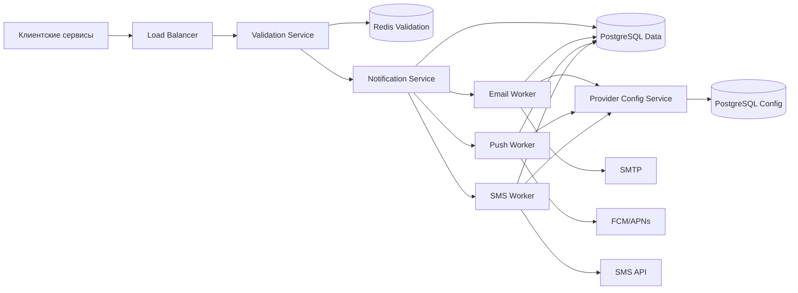
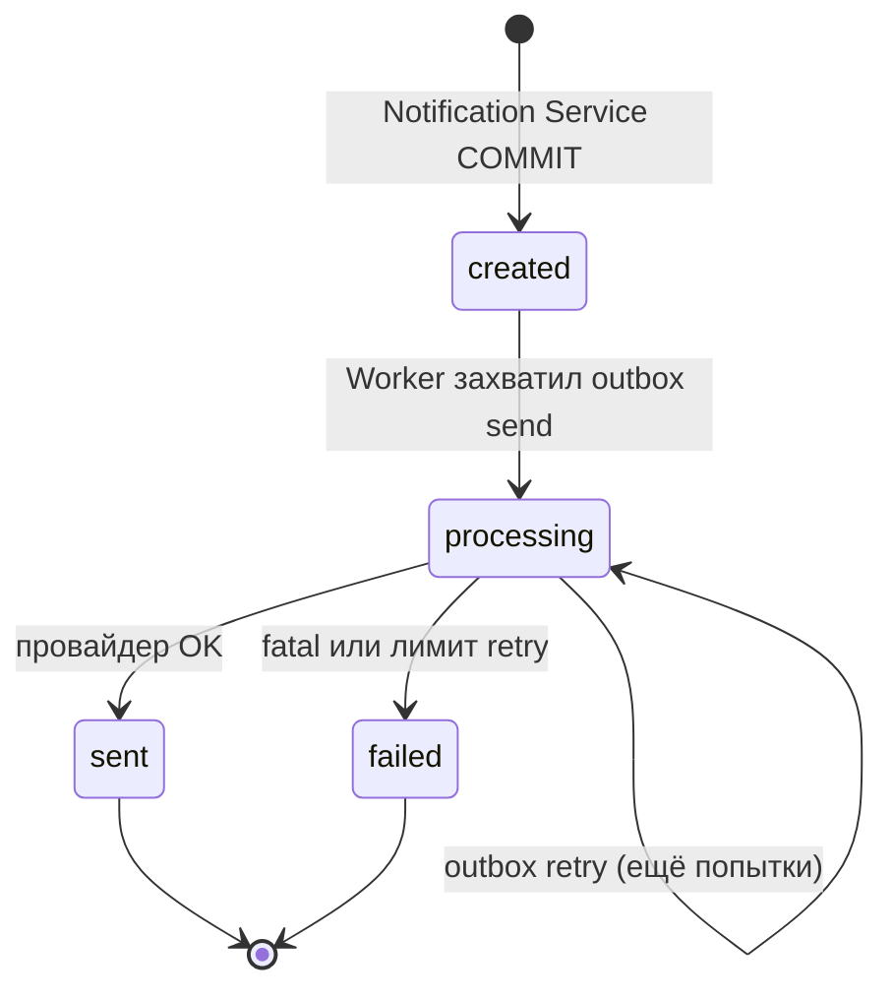
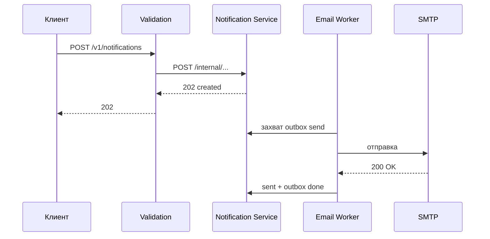
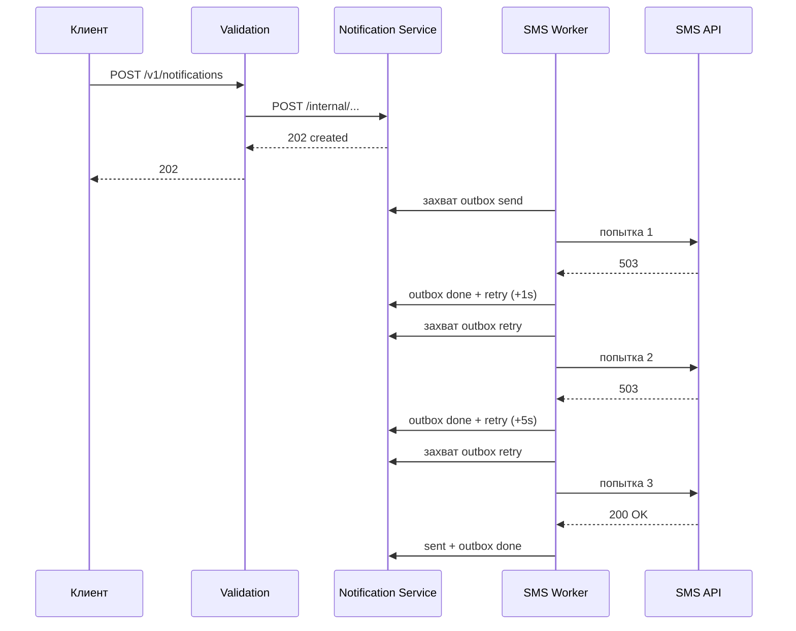
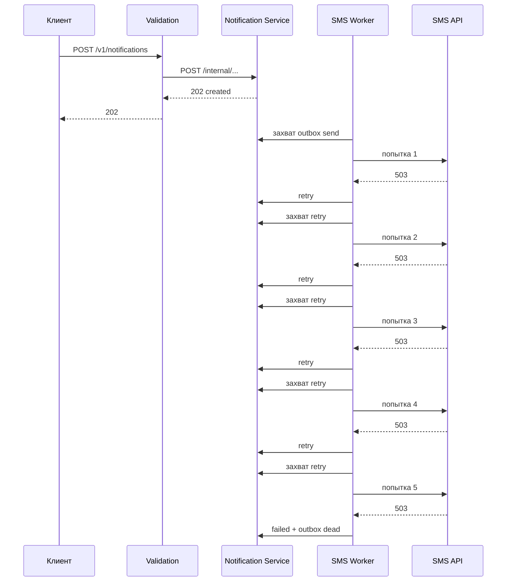
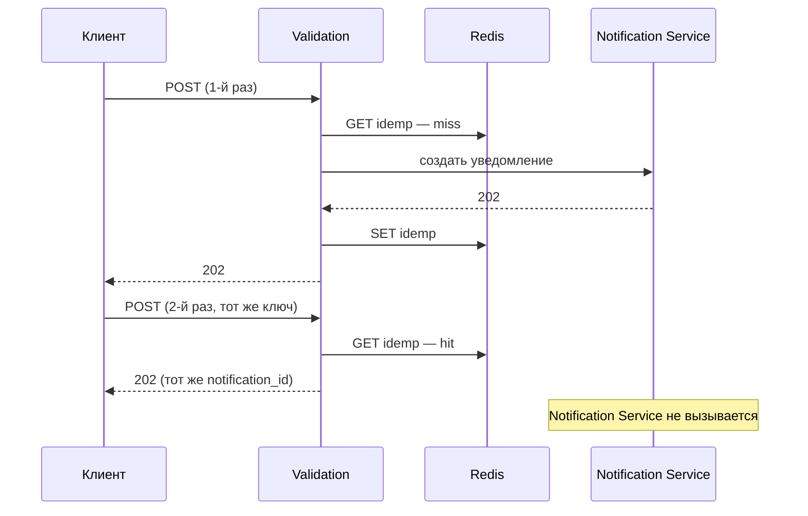

# Техническое решение проекта «Сервис уведомлений»

## 1. Введение

Сервис уведомлений — входная точка для внутренних систем, которым нужно доставить пользователю сообщение по одному из каналов: email, push или SMS. Внешний сервис не общается с провайдерами напрямую: он передаёт тип уведомления, получателя, канал и параметры для шаблона, а платформа берёт на себя маршрутизацию, подготовку текста, отправку и учёт результата.

Пиковая нагрузка — до **20 000 запросов на создание уведомления в секунду**. На критическом пути остаётся только приём и надёжная фиксация факта постановки в очередь (P95 ≤ 100 мс). Фактическая доставка выполняется асинхронно и зависит от канала и внешнего провайдера.

Ключевые ограничения, которые определяют архитектуру:

- высокая доля записи при приёме;
- внешние провайдеры с лимитами и периодической недоступностью;
- запрет на «случайные» дубли при повторных запросах клиента и при at-least-once доставке внутри платформы.

Решение разделено на **Control Plane** (шаблоны, **Provider Config Service** — конфигурации провайдеров в отдельной БД) и **Data Plane** (балансировщик → сервис валидации → основной сервис уведомлений → воркеры провайдеров, outbox, история).

---

## 2. Основные пользовательские и технические сценарии

### 2.1. Пользовательские

Сценарии со стороны внутренних сервисов и конечного получателя.

| Сценарий | Описание |
|----------|----------|
| **Отправка уведомления** | Сервис заказов вызывает `POST /v1/notifications` (email / push / SMS), передаёт получателя, тип и параметры шаблона — получает `notification_id` и статус `created` |
| **Повтор запроса** | Клиент ретраит HTTP с тем же `Idempotency-Key` — получает тот же ответ, второе уведомление не создаётся |
| **Статус доставки** | По `GET /v1/notifications/{id}` видно текущий статус: `created`, `processing`, `sent` или `failed` |
| **История по получателю** | `GET /v1/notifications?recipient_id=…&from=…&to=…` — список уведомлений и timeline событий за период |
| **Разные каналы** | Один и тот же бизнес-событие может уйти разными каналами (например, SMS с кодом и email с деталями заказа) — независимо друг от друга |

### 2.2. Технические

Сценарии работы платформы «под капотом».

| Сценарий | Описание |
|----------|----------|
| **Приём и постановка в очередь** | Validation → Notification Service: одна транзакция `notifications` + `outbox` + запись в `notification_history`; ответ **202** без вызова провайдера |
| **Асинхронная доставка** | Provider Worker забирает задачу из outbox (`SELECT … FOR UPDATE SKIP LOCKED`), рендерит шаблон, вызывает провайдера |
| **Успешная отправка** | Провайдер вернул OK → `status = sent`, outbox `done`, снимок в history |
| **Retry при сбое провайдера** | Временная ошибка (503, timeout) → новая строка outbox `retry` с `scheduled_at`; до `max_attempts` |
| **Финальный отказ** | Fatal-ошибка или исчерпан лимит попыток → `status = failed`, outbox `dead` |
| **Защита от дублей** | Идемпотентность на приёме (Redis) + уникальный индекс в PostgreSQL |
| **Ограничение нагрузки на провайдера** | Rate limiter и circuit breaker на воркере; конфигурация из Provider Config Service |
| **Обновление конфигурации** | Администратор меняет лимиты или endpoint в Provider Config Service — воркеры подхватывают через кэш без рестарта |

---

## 3. Глоссарий

| Термин | Определение                                                                                         |
|--------|-----------------------------------------------------------------------------------------------------|
| Уведомление | Сущность с идентификатором, получателем, каналом, типом и жизненным циклом доставки.                |
| Канал доставки | Способ отправки: `email`, `push`, `sms`. У каждого канала свои лимиты на размер и формат сообщения. |
| Шаблон | Текстовая заготовка с плейсхолдерами; компилируется при старте воркера.                             |
| Провайдер | Внешний API доставки (SMTP-шлюз, FCM/APNs, SMS-агрегатор).                                          |
| Idempotency key | Ключ, который клиент передаёт для защиты от повторного создания при ретрае HTTP.                    |
| Worker | Сущность ответственная за рендер и отправку сообщения в соответствующий провайдер                   |
| Retry | Повторная попытка отправки после временной ошибки провайдера.                                       |
| Rate limiting | Ограничение скорости вызовов провайдера и/или приёма по клиенту.                                    |
| Deduplication | Гарантия, что одно логическое уведомление не уйдёт пользователю дважды.                             |
| Outbox | Таблица задач на отправку/повтор; запись в одной транзакции с уведомлением; обрабатывается воркерами. |
| Validation Service | Сервис проверки запроса и идемпотентности (собственный Redis).                                      |
| Provider Config Service | Control Plane: хранение и выдача конфигурации провайдера по каналу (лимиты, endpoint, retry-политика). |

---

## 4. Функциональные требования

Система обеспечивает:

1. **Приём запросов:** создание уведомления с указанием получателя (`recipient_id` или адрес), канала, типа и параметров шаблона; возврат `notification_id` и текущего статуса.
2. **Каналы:** независимая обработка email, push и SMS с валидацией формата до вызова провайдера.
3. **Шаблоны:** выбор шаблона по типу и каналу, подстановка параметров, формирование итогового тела/заголовка перед отправкой.
4. **Отправка:** вызов провайдера, сохранение результата (`provider_message_id`, код ошибки, время).
5. **Retry:** повтор при временных сбоях, ограничение числа попыток, перевод в `failed` после исчерпания лимита.
6. **Дедупликация:** защита от дублей при повторе HTTP-запроса, повторной обработке строки outbox и сбоях между записью в БД и вызовом провайдера.
7. **Статусы:** `created` → `processing` → `sent` | `failed`.
8. **История:** выборка по получателю/периоду с каналом, временем отправки и статусом.

---

## 5. Нефункциональные требования

| Область | Требование | Следствие для архитектуры |
|---------|------------|---------------------------|
| Нагрузка | до 20 000 RPS на приём в пике | LB + Validation Service + Notification Service; outbox с партициями |
| Latency приёма | P95 ≤ 100 мс | Провайдер не вызывается в HTTP; одна транзакция «уведомление + outbox» |
| Надёжность | не терять принятые уведомления | Outbox в той же транзакции, что и `notifications`; воркеры `FOR UPDATE SKIP LOCKED` |
| Консистентность | надёжный факт приёма; история — eventual | Primary для записи; `notification_history` append-only; чтение с replica |
| Масштабирование | отдельно: приём, валидация, воркеры по каналам | Независимые пулы Validation / Notification / email / push / sms workers |
| Ограничения | rate limit, изоляция каналов | Rate limiter + circuit breaker на воркер каждого провайдера |

---

## 6. Архитектура решения (общая схема)

Платформа построена вокруг **outbox в PostgreSQL**: приём фиксирует уведомление и задачу на доставку в одной транзакции; воркеры провайдеров забирают задачи через `SELECT … FOR UPDATE SKIP LOCKED`. **Kafka не используется** — очередь доставки и retry — строки в партиционированной таблице `outbox_events`.

### 6.1. Семь шагов потока (видение решения)



---

## 7. Компоненты

### 7.1. Load Balancer

- Обычный балансировщик нагрузки

### 7.2. Validation Service

Первый контур приёма — всё, что должно уложиться в **P95 ≤ 100 ms** до записи в основную БД.

| Задача | Что делает |
|--------|------------|
| **Валидация** | Проверяет формат запроса, канал, шаблон и параметры |
| **Дедупликация** | Ищет `Idempotency-Key` в Redis — при повторе отдаёт прежний ответ |
| **Фиксация** | После успеха в Notification Service сохраняет ключ и результат |

> Не пишет в `notifications` и outbox.

### 7.3. Notification Service (основной)

Ядро Data Plane: **сохраняет** уведомление и ставит задачу на доставку. Провайдер на этом этапе **не вызывается** — только запись в БД и outbox.

| Задача | Что делает |
|--------|------------|
| **Создание** | В одной транзакции: `notifications` (`created`) + `outbox_events` (`send`, `pending`) + первая запись в `notification_history` |
| **API уведомлений** | `POST /internal/v1/notifications` — приём от Validation Service; `GET /v1/notifications/{id}` — статус уведомления |
| **API истории** | `GET /v1/notifications?recipient_id=…&from=…&to=…` — история и timeline по получателю (read-replica) |

> Ответ клиенту после создания: **202** с `notification_id`, `status`, `created_at`. Доставку выполняют **Provider Workers** (§7.4).

### 7.4. Provider Workers

Асинхронная доставка: отдельный сервис **на канал** (email / push / sms). Каждый воркер обслуживает только своего провайдера.

| Задача | Что делает |
|--------|------------|
| **Захват задачи** | `SELECT … FOR UPDATE SKIP LOCKED` по outbox с фильтром своего канала (`pending`, `scheduled_at` готов) — без конкуренции между воркерами |
| **Доставка** | Рендер шаблона → конфиг из Provider Config Service → rate limit и circuit breaker → вызов провайдера |
| **Результат** | Обновляет `notifications`, outbox и `notification_history`: `sent`, retry или `failed` |

---

## 7. Модель данных

### 7.1. `notifications` (текущее состояние)

| Поле | Описание |
|------|----------|
| `notification_id` | Уникальный идентификатор уведомления PK |
| `client_id` | Идентификатор вызывающего сервиса; в паре с `idempotency_key` — UNIQUE |
| `idempotency_key` | Ключ идемпотентности от клиента; защита от дубля при повторе HTTP |
| `channel` | Канал доставки: `email`, `push` или `sms` |
| `notification_type` | Тип уведомления; вместе с каналом определяет шаблон |
| `payload` | JSON с параметрами для подстановки в шаблон |
| `recipient_id` | Идентификатор получателя во внутренней системе (если передан) |
| `recipient_address` | Адрес доставки: email, номер телефона или push-token |
| `status` | Текущий статус: `created` → `processing` → `sent` \| `failed` |
| `created_at` | Время создания записи (приём запроса) |
| `update_at` | Время последнего изменения статуса или полей доставки |

### 7.2. `outbox_events` (очередь доставки и retry)

| Поле | Описание |
|------|----------|
| `outbox_id` | UUID, PK (в пределах партиции) |
| `notification_id` | FK |
| `channel` | email \| push \| sms — по какому воркеру читать |
| `status` | pending → processing → done \| dead |
| `attempt_no` | номер попытки (1..N) |
| `scheduled_at` | для retry: не обрабатывать раньше этого времени |
| `created_at` | **ключ партиционирования** |
| `processed_at` | когда задача завершена |

### 7.3. `notification_history` (append-only)

Каждое значимое изменение — **новая строка**, старые не обновляются.

| Поле | Описание                                                                                                         |
|------|------------------------------------------------------------------------------------------------------------------|
| `notification_id` | Идентификатор уведомления (FK)                                                                                   |
| `snapshot` | JSONB-снимок состояния уведомления в момент события |
| `created_at` | Время события                                                                                                    |


### 7.4. Диаграмма состояний уведомления



---

## 8. Outbox и партиционирование

### 8.1. Зачем партиционировать

При 20k RPS приёма outbox растёт **~20k строк/с** на `send` плюс строки `retry`. Без партиций:

- колличество данных в outbox сильно растет;
- autovacuum перегружен;

### 8.2. Схема партиционирования

**RANGE по `created_at`**, помесячные партиции:

```sql
CREATE TABLE outbox_events (
  ...
) PARTITION BY RANGE (created_at);

CREATE TABLE outbox_events_2026_05
  PARTITION OF outbox_events
  FOR VALUES FROM ('2026-05-01') TO ('2026-06-01');
```


Создание партиций -  Cron / pg_partman: партиция на текущий + следующий месяц
Архив - Партиции старше 30–90 дней → DETACH → cold storage или DROP после TTL
Retry - `scheduled_at` может попасть в следующий месяц — воркер читает **текущую и предыдущую** партицию

---

## 10. Детальные сценарии

Ниже — пошаговое поведение системы для четырёх типовых случаев.  
**Предусловие для всех сценариев доставки:** активный шаблон и конфигурация канала есть в Control Plane; `max_attempts = 5`, backoff `[1s, 5s, 15s, 60s, 300s]` (из Provider Config Service).

---

### 10.1. Полностью успешный сценарий

**Контекст:** сервис заказов отправляет email «Заказ отправлен» (`notification_type = order_shipped`, канал `email`).

| Шаг | Участник | Действие                                                                                                                                                                                                      |
|-----|----------|---------------------------------------------------------------------------------------------------------------------------------------------------------------------------------------------------------------|
| 1 | Клиент → LB → Validation | `POST /v1/notifications` + заголовок `Idempotency-Key: ord-9912-1`. Redis: ключа нет                                                                                                                          |
| 2 | Validation | Проверка JSON, канала, шаблона, параметров (`tracking_url`, `order_id`) — OK                                                                                                                                  |
| 3 | Validation → Notification Service | `POST /internal/v1/notifications`                                                                                                                                                                             |
| 4 | Notification Service | **Одна транзакция:** `notifications.status = created`; outbox: `event_type = send`, `status = pending`, `attempt_no = 1`; history: `snapshot = { "status": "created", "event": "notification_created", ... }` |
| 5 | Validation → Клиент | **202** `{ notification_id, status: "created", created_at }`; в Redis: `idemp:{client_id}:ord-9912-1` → тот же ответ                                                                                          |
| 6 | Email Worker | `SELECT … FOR UPDATE SKIP LOCKED` — захват строки outbox (`channel = email`, `pending`)                                                                                                                       |
| 7 | Email Worker | Транзакция: outbox → `processing`; `notifications.status = processing`; history: `snapshot.event = status_processing`                                                                                         |
| 8 | Email Worker | Рендер шаблона; конфиг SMTP из Provider Config Service (кэш); rate limit OK, breaker **closed**                                                                                                               |
| 9 | Email Worker → SMTP | Вызов провайдера → **200 OK**, `provider_message_id = smtp-abc`                                                                                                                                               |
| 10 | Email Worker | Транзакция: `notifications.status = sent`, `update_at = now()`; outbox → `done`; history: `snapshot.event = delivery_success`                                                                                 |

**Итог:** одно уведомление, одна строка outbox (`send` → `done`), три записи в history (created → processing → success). Клиент может получить `GET /v1/notifications/{id}` → `status: sent`.



---

### 10.2. Сценарий с retry и переходом в success

**Контекст:** сервис авторизации отправляет SMS с кодом входа (`notification_type = login_otp`, канал `sms`); провайдер дважды отвечает **503**, на третьей попытке — **200**.

| Шаг | Участник | Действие |
|-----|----------|----------|
| 1 | Клиент → LB → Validation | `POST /v1/notifications` + `Idempotency-Key: auth-7721`. Redis: ключа нет |
| 2 | Validation | Проверка JSON, канала `sms`, шаблона, параметров (`code`, `minutes`) — OK |
| 3 | Validation → Notification Service | `POST /internal/v1/notifications` |
| 4 | Notification Service | **Одна транзакция:** `notifications.status = created`; outbox: `send`, `pending`, `attempt_no = 1`; history: `notification_created` |
| 5 | Validation → Клиент | **202** `{ notification_id, status: "created" }`; фиксация ключа в Redis |
| 6 | SMS Worker | Захват outbox `send` → `processing`; `notifications.status = processing` |
| 7 | SMS Worker → SMS API | **Попытка 1** → **503** → outbox `done`, новый `retry` (`attempt_no = 2`, `+1s`); history: `delivery_retry_scheduled` |
| 8 | SMS Worker → SMS API | **Попытка 2** → **503** → та же схема: outbox `done`, `retry` (`attempt_no = 3`, `+5s`) |
| 9 | SMS Worker → SMS API | **Попытка 3** → **200 OK** → `notifications.status = sent`; outbox `done`; history: `delivery_success` |

**Итог:** одно уведомление, три строки outbox (`send` + 2× `retry`, все `done`); пользователь получил **одно** SMS. В history: `notification_created` → `status_processing` → 2× `delivery_retry_scheduled` → `delivery_success`.



---

### 10.3. Сценарий с retry и переходом в fail

**Контекст:** SMS с кодом входа (`channel = sms`); провайдер на каждой попытке отвечает **503**; после 5-й попытки лимит `max_attempts` исчерпан → `failed`.

| Шаг | Участник | Действие |
|-----|----------|----------|
| 1 | Клиент → LB → Validation | `POST /v1/notifications` + `Idempotency-Key: auth-9900`. Redis: ключа нет |
| 2 | Validation | Проверка запроса — OK |
| 3 | Validation → Notification Service | `POST /internal/v1/notifications` |
| 4 | Notification Service | `notifications.status = created`; outbox `send`, `pending`, `attempt_no = 1`; history: `notification_created` |
| 5 | Validation → Клиент | **202**; фиксация ключа в Redis |
| 6 | SMS Worker | Захват outbox `send` → `processing` |
| 7 | SMS Worker → SMS API | **Попытка 1** → **503** → outbox `done`, `retry` (`attempt_no = 2`, `+1s`) |
| 8 | SMS Worker → SMS API | **Попытки 2–4** → каждая **503**; после каждой: outbox `done`, новый `retry` (`+5s`, `+15s`, `+60s`) |
| 9 | SMS Worker → SMS API | **Попытка 5** → **503**; `attempt_no >= max_attempts` |
| 10 | SMS Worker | `notifications.status = failed`; outbox → **`dead`**; history: `delivery_failed`. Новый outbox **не создаётся** |

**Итог:** пять строк outbox (`send` + 4× `retry` в `done`, последняя в `dead`); SMS пользователю не доставлено. Клиент: `GET /v1/notifications/{id}` → `status: failed`.



---

### 10.4. Дубликат (повтор HTTP-запроса)

**Контекст:** клиент отправил тот же запрос дважды с одним `Idempotency-Key` (таймаут сети, retry на стороне клиента).

| Шаг | Запрос | Что происходит |
|-----|--------|----------------|
| **Первый** | `Idempotency-Key: pay-44` | Redis miss → Validation → Notification Service → **202**, `notification_id = N-1`. Redis: `SET idemp:...` → `{ notification_id: N-1, status: created, ... }` |
| **Второй** | тот же ключ | Redis **hit** → Validation **не вызывает** Notification Service |
| **Ответ второго** | — | **200/202** с тем же телом, что и у первого (`notification_id = N-1`) |

**Итог:** пользователь не получает второе сообщение; воркер обрабатывает outbox только один раз. Если Redis недоступен — срабатывает запасной механизм: `UNIQUE(client_id, idempotency_key)` в PostgreSQL отклонит повторную вставку, Validation вернёт сохранённый результат (выше latency).



---

## 11. Архитектура приёма, маршрутизации и отправки уведомлений

- **Приём:** `LB → Validation → Notification Service` — валидация, идемпотентность, запись `notifications` + outbox, ответ **202** (P95 ≤ 100 ms).
- **Маршрутизация:** канал в запросе (`email` / `push` / `sms`); воркер забирает из outbox только свои задачи (`WHERE channel = …`).
- **Отправка:** Provider Worker → рендер → провайдер; retry — новая строка outbox, результат — `sent` / `failed`.

---

## 12. Подход к работе с шаблонами

- **Хранение:** шаблоны в Control Plane по паре `(notification_type, channel)` с версией; у каждого канала свой формат (subject/body для email, текст SMS, заголовок push).
- **При приёме:** проверяем, что активный шаблон есть и все `required_params` переданы в `payload`;
- **При отправке:** воркер рендерит сообщение из шаблона и `payload` уже принятого уведомления.

---

## 13. Подход к хранению истории уведомлений

- **Модель:** таблица `notification_history` append-only — каждое событие новая строка (`notification_id`, `snapshot` JSONB, `created_at`); старые записи не меняются.
- **Запись:** снимок пишется в той же транзакции, что и смена статуса (`created`, `processing`, retry, `sent`, `failed`).
- **Чтение:** по notification_id и timestamp

---

## 14. Подход к масштабированию и обеспечению отказоустойчивости

Система проектируется под пик **20 000 RPS** на приём и неравномерную нагрузку на доставку. Масштабируются **отдельные контуры**, а не монолит целиком.

### 14.1. Масштабирование

| Контур | Как масштабируется | Зачем отдельно |
|--------|-------------------|----------------|
| Load Balancer | Горизонтально (active/active) | Рост входящего HTTP |
| Validation Service | 4–8 инстансов за LB | Лёгкая валидация и Redis; разгрузка Notification Service |
| Notification Service (HTTP) | 4–6 инстансов | Запись в PostgreSQL на приёме |
| Email / Push / SMS workers | Независимо, по lag outbox на канал | У email и SMS разная нагрузка и лимиты провайдеров |
| Provider Config Service | 2 инстанса, read-heavy | Конфиг не на критическом пути приёма |
| PostgreSQL (outbox) | Партиции по `created_at` (помесячно) | Чтобы индекс и vacuum не деградировали на 20k+ строк/с |
| История | Read-replica для `GET` | Запись на primary, чтение не мешает приёму |

Все сервисы приёма и воркеры **stateless**: состояние — в PostgreSQL, Redis и Provider Config Service. Sticky sessions на LB **не нужны**. Воркеры конкурируют за outbox через `SELECT … FOR UPDATE SKIP LOCKED` — добавление инстанса увеличивает пропускную способность канала без координации между ними.

### 14.2. Отказоустойчивость

| Сбой | Поведение системы |
|------|-------------------|
| Падение инстанса Validation / Notification | LB исключает инстанс по health check; трафик на оставшиеся |
| Redis Validation недоступен | Fallback на `UNIQUE(client_id, idempotency_key)` в PostgreSQL — выше latency, дубли не создаются |
| Notification Service недоступен после Validation | Клиент получает **502**; повтор с тем же `Idempotency-Key` не создаёт второе уведомление |
| Падение Provider Worker | Строки outbox остаются `pending`; другие воркеры того же канала подхватывают задачи |
| Provider Config Service недоступен | Воркер работает на последнем кэше; без кэша — откладывает задачу (`scheduled_at`) |
| Временная недоступность провайдера (503) | Retry через новые строки outbox; circuit breaker снижает «шторм» запросов |
| Падение PostgreSQL primary | Patroni failover; `notifications` и outbox на primary — после переключения воркеры продолжают с `pending` |
| Проблемы одного канала | Email, push и SMS изолированы: отдельные воркеры, лимиты и circuit breaker |

**Главный принцип:** факт приёма фиксируется синхронно в одной транзакции с outbox; доставка — асинхронно и переживает рестарты воркеров. Принятое уведомление не теряется, пока строка outbox в статусе `pending` или `retry`.

---

## 15. Основные компромиссы выбранного решения

| Решение | Плюс | Минус                                                                                         |
|---------|------|-----------------------------------------------------------------------------------------------|
| **Outbox в PostgreSQL** | Транзакционность с `notifications` — нет dual-write; проще эксплуатация (одна СУБД) | Высокая нагрузка на PostgreSQL; обязательны партиции outbox и tuning vacuum                   |
| **`SELECT FOR UPDATE SKIP LOCKED`** на outbox | Нет дублей задач между воркерами; не нужен отдельный брокер | дополнительно нагружает autovacuum                                                            |
| **Отдельный Validation Service + Redis** | Приём и идемпотентность масштабируются отдельно от доставки | новая точка падения                                                                           |
| **History append-only + JSONB snapshot** | Полный audit trail; гибкая схема событий в `snapshot` | Рост таблицы history; для аналитики на годах — архив или выгрузка                             |
| **Provider Config Service отдельно** | Смена лимитов и endpoint без рестарта воркеров | Задержка применения до TTL кэша (30–60 с); ещё один сервис в эксплуатации                     |
| **Асинхронная доставка** | P95 приёма ≤ 100 ms при 20k RPS | Клиент не узнаёт об успехе/ошибке провайдера в том же HTTP-ответе — только по статусу/history |

Глобально есть проблема с большой нагрузкой на бд. Для того чтобы выдерживать большие нагрузки необходимо разносить уведомления, outbox, историчность по разным бд, однако это значительно усложняет систему. 
Разделить бд уведомлений на шарды или архивную бд чтобы распределить нагрузку. 
Также можно применить append only transactional outbox что значительно уменьшит нагрузку на autovacuum и позволит ращгрузить бд.


**Что сознательно не входит в scope:** публичная аутентификация (mTLS между сервисами), UI админки, webhook статусов наружу — это упрощает первую версию, но перекладывает интеграцию на polling (`GET`) со стороны клиентов.

