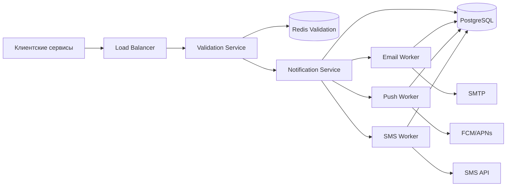
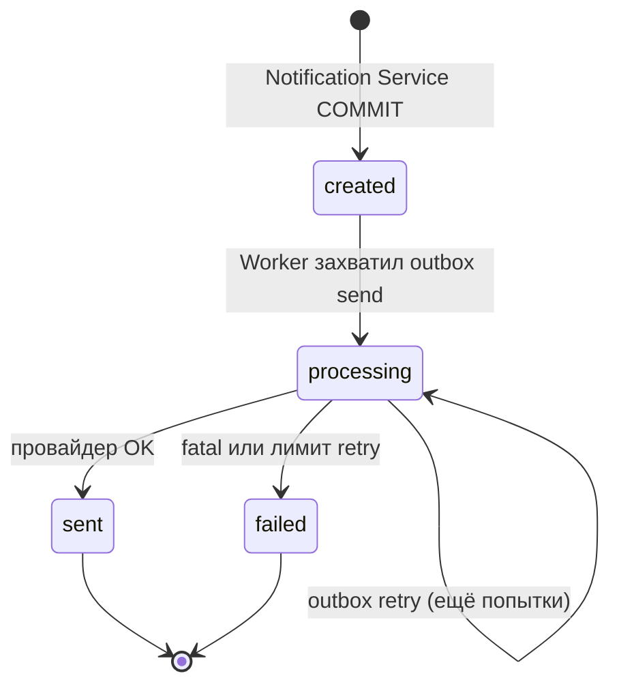

# Техническое решение проекта «Сервис уведомлений»

## 1. Введение

Сервис уведомлений — входная точка для внутренних систем, которым нужно доставить пользователю сообщение по одному из каналов: email, push или SMS. Внешний сервис не общается с провайдерами напрямую: он передаёт тип уведомления, получателя, канал и параметры для шаблона, а платформа берёт на себя маршрутизацию, подготовку текста, отправку и учёт результата.

Пиковая нагрузка — до **20 000 запросов на создание уведомления в секунду**. На критическом пути остаётся только приём и надёжная фиксация факта постановки в очередь (P95 ≤ 100 мс). Фактическая доставка выполняется асинхронно и зависит от канала и внешнего провайдера.

Ключевые ограничения, которые определяют архитектуру:

- высокая доля записи при приёме;
- внешние провайдеры с лимитами и периодической недоступностью;
- запрет на «случайные» дубли при повторных запросах клиента и при at-least-once доставке внутри платформы.

Решение разделено на **Control Plane** (шаблоны, политики провайдеров) и **Data Plane** (балансировщик → сервис валидации → основной сервис уведомлений → воркеры провайдеров, outbox, история).

---

## 2. Глоссарий

| Термин | Определение                                                                                         |
|--------|-----------------------------------------------------------------------------------------------------|
| Уведомление | Сущность с идентификатором, получателем, каналом, типом и жизненным циклом доставки.                |
| Канал доставки | Способ отправки: `email`, `push`, `sms`. У каждого канала свои лимиты на размер и формат сообщения. |
| Шаблон | Текстовая заготовка с плейсхолдерами; компилируется при старте воркера.                             |
| Провайдер | Внешний API доставки (SMTP-шлюз, FCM/APNs, SMS-агрегатор).                                          |
| Idempotency key | Ключ, который клиент передаёт для защиты от повторного создания при ретрае HTTP.                    |
| Worker | Сущность ответственная за рендер и отправку сообщения в соответствующий провайдер                   |
| Retry | Повторная попытка отправки после временной ошибки провайдера.                                       |
| Rate limiting | Ограничение скорости вызовов провайдера и/или приёма по клиенту.                                    |
| Deduplication | Гарантия, что одно логическое уведомление не уйдёт пользователю дважды.                             |
| Outbox | Таблица задач на отправку/повтор; запись в одной транзакции с уведомлением; обрабатывается воркерами. |
| Validation Service | Сервис проверки запроса и идемпотентности (собственный Redis).                                      |

---

## 3. Функциональные требования

Система обеспечивает:

1. **Приём запросов:** создание уведомления с указанием получателя (`recipient_id` или адрес), канала, типа и параметров шаблона; возврат `notification_id` и текущего статуса.
2. **Каналы:** независимая обработка email, push и SMS с валидацией формата до вызова провайдера.
3. **Шаблоны:** выбор шаблона по типу и каналу, подстановка параметров, формирование итогового тела/заголовка перед отправкой.
4. **Отправка:** вызов провайдера, сохранение результата (`provider_message_id`, код ошибки, время).
5. **Retry:** повтор при временных сбоях, ограничение числа попыток, перевод в `failed` после исчерпания лимита.
6. **Дедупликация:** защита от дублей при повторе HTTP-запроса, повторной обработке строки outbox и сбоях между записью в БД и вызовом провайдера.
7. **Статусы:** `created` → `processing` → `sent` | `failed`.
8. **История:** выборка по получателю/периоду с каналом, временем отправки и статусом.

---

## 4. Нефункциональные требования

| Область | Требование | Следствие для архитектуры |
|---------|------------|---------------------------|
| Нагрузка | до 20 000 RPS на приём в пике | LB + Validation Service + Notification Service; outbox с партициями |
| Latency приёма | P95 ≤ 100 мс | Провайдер не вызывается в HTTP; одна транзакция «уведомление + outbox» |
| Надёжность | не терять принятые уведомления | Outbox в той же транзакции, что и `notifications`; воркеры `FOR UPDATE SKIP LOCKED` |
| Консистентность | надёжный факт приёма; история — eventual | Primary для записи; `notification_history` append-only; чтение с replica |
| Масштабирование | отдельно: приём, валидация, воркеры по каналам | Независимые пулы Validation / Notification / email / push / sms workers |
| Ограничения | rate limit, изоляция каналов | Rate limiter + circuit breaker на воркер каждого провайдера |

---

## 5. Архитектура решения (общая схема)

Платформа построена вокруг **outbox в PostgreSQL**: приём фиксирует уведомление и задачу на доставку в одной транзакции; воркеры провайдеров забирают задачи через `SELECT … FOR UPDATE SKIP LOCKED`. **Kafka не используется** — очередь доставки и retry — строки в партиционированной таблице `outbox_events`.

### 5.1. Семь шагов потока (видение решения)



| Шаг | Компонент | Действие |
|-----|-----------|----------|
| **1** | Load Balancer | Принимает `POST /v1/notifications`, распределяет по инстансам Validation Service |
| **2** | Validation Service | Проверяет JSON, шаблон, параметры; **идемпотентность в своём Redis** |
| **3** | Notification Service | В одной транзакции: `notifications` (`created`) + `outbox_events` (`send`) + запись в `notification_history` |
| **4** | Provider Worker | `SELECT FOR UPDATE SKIP LOCKED` по своему каналу → `processing` → рендер → вызов провайдера; при ошибке — **outbox `retry`**, при успехе — **`sent`** |
| **5** | Provider Worker | Работает с **rate limiter** и **circuit breaker** конкретного провайдера |
| **6** | Любое изменение статуса | **Append** строки в `notification_history` |
| **7** | Outbox | Таблица **партиционирована** по времени (см. §8) |

> В п.4 вашего видения финальный успешный статус — **`sent`** (не `created`).

---

## 6. Компоненты

### 6.1. Load Balancer

- HAProxy / cloud LB, TLS на периметре.
- Health check Validation Service.
- Sticky sessions **не нужны** — сервисы stateless (воркеры конкурируют за outbox через `SKIP LOCKED`).

### 6.2. Validation Service

**Зона ответственности:** всё, что должно уложиться в P95 ≤ 100 ms **до** записи в основную БД.

| Этап | Деталь |
|------|--------|
| Синтаксис | JSON, обязательные поля, `channel ∈ {email, push, sms}` |
| Шаблон | Есть активный шаблон `(notification_type, channel)`; `required_params` ⊆ `payload` |
| Идемпотентность | **Собственный Redis Cluster** (отдельный от rate limit воркеров) |

**Идемпотентность (Redis Validation):**

```
KEY: idemp:{client_id}:{idempotency_key}
VALUE: { "notification_id": "...", "status": "...", "created_at": "..." }
TTL: 86400 (24 ч)
```

Алгоритм:

1. `GET idemp:...` — если есть → **200** с сохранённым телом (без вызова Notification Service).
2. Если нет → HTTP во **внутренний** Notification Service.
3. После успешного ответа Notification Service → `SET idemp:...` с результатом.

Дублирующий уникальный индекс `(client_id, idempotency_key)` в PostgreSQL остаётся **страховкой**, если Redis протух или недоступен.

Validation Service **не пишет** в `notifications` и **не трогает** outbox.

### 6.3. Notification Service (основной)

**Зона ответственности:** создание уведомления и постановка задачи на доставку.

Внутренний endpoint (только из Validation Service):

```http
POST /internal/v1/notifications
```

**Одна транзакция PostgreSQL:**

```sql
BEGIN;

INSERT INTO notifications (
  notification_id, client_id, idempotency_key,
  channel, notification_type, template_version,
  recipient_id, recipient_address, payload,
  status, created_at, attempt_count
) VALUES (..., 'created', now(), 0);

INSERT INTO outbox_events (
  outbox_id, notification_id, channel,
  event_type, status, attempt_no, created_at
) VALUES (..., ..., 'email', 'send', 'pending', 1, now());

INSERT INTO notification_history (
  history_id, notification_id, status, channel,
  event_type, payload_snapshot, created_at
) VALUES (..., ..., 'created', 'email', 'notification_created', ...);

COMMIT;
```

Ответ Validation Service → клиенту:

```json
HTTP 202
{
  "notification_id": "550e8400-...",
  "status": "created",
  "created_at": "2026-05-18T14:22:01Z"
}
```

Провайдер **не вызывается**. Задача на отправку — строка outbox `event_type = send`, `status = pending`.

В том же процессе (или отдельных deployment) крутятся **Provider Workers** — см. §6.4.

### 6.4. Provider Workers (в составе Notification Service)

Отдельный пул горутин/процессов **на канал** (email / push / sms). Каждый воркер знает только своего провайдера.

**Цикл воркера (email):**

```sql
BEGIN;

SELECT o.outbox_id, o.notification_id, o.attempt_no, o.event_type,
       n.template_version, n.payload, n.recipient_address, n.status
FROM outbox_events o
JOIN notifications n ON n.notification_id = o.notification_id
WHERE o.channel = 'email'
  AND o.status = 'pending'
  AND (o.scheduled_at IS NULL OR o.scheduled_at <= now())
ORDER BY o.created_at
LIMIT 1
FOR UPDATE OF o SKIP LOCKED;

UPDATE outbox_events SET status = 'processing' WHERE outbox_id = :id;

UPDATE notifications
SET status = 'processing', processing_at = now()
WHERE notification_id = :nid AND status IN ('created', 'processing');

INSERT INTO notification_history (...)  -- статус processing

COMMIT;
```

Далее **вне** длинной транзакции (чтобы не держать lock на outbox на время SMTP):

1. Рендер шаблона (`template_version` + `payload`).
2. **Rate limiter** провайдера (§10).
3. **Circuit breaker** (§10).
4. Вызов SMTP.
5. Транзакция результата (§9).

Масштабирование: N инстансов Notification Service, каждый с email-воркерами; `SKIP LOCKED` распределяет строки outbox без дублей.

---

## 7. Модель данных

### 7.1. `notifications` (текущее состояние)

| Поле | Описание |
|------|----------|
| `notification_id` | UUID, PK |
| `client_id`, `idempotency_key` | UNIQUE(client_id, idempotency_key) |
| `channel` | email \| push \| sms |
| `notification_type`, `template_version`, `payload` | |
| `status` | created → processing → sent \| failed |
| `attempt_count` | число попыток вызова провайдера |
| `provider_message_id`, `last_error` | |
| `created_at`, `processing_at`, `sent_at`, `failed_at` | |

### 7.2. `outbox_events` (очередь доставки и retry)

| Поле | Описание |
|------|----------|
| `outbox_id` | UUID, PK (в пределах партиции) |
| `notification_id` | FK |
| `channel` | email \| push \| sms — по какому воркеру читать |
| `event_type` | `send` — первая доставка; `retry` — повтор |
| `status` | pending → processing → done \| dead |
| `attempt_no` | номер попытки (1..N) |
| `scheduled_at` | для retry: не обрабатывать раньше этого времени |
| `created_at` | **ключ партиционирования** |
| `processed_at` | когда задача завершена |

Индекс для воркера:

```sql
CREATE INDEX idx_outbox_worker ON outbox_events (channel, status, scheduled_at, created_at)
WHERE status = 'pending';
```

### 7.3. `notification_history` (append-only)

Каждое значимое изменение — **новая строка**, старые не обновляются.

| Поле | Описание |
|------|----------|
| `history_id` | bigserial / UUID |
| `notification_id` | |
| `status` | снимок статуса в момент события |
| `channel` | |
| `event_type` | notification_created, status_processing, delivery_success, delivery_retry_scheduled, delivery_failed, … |
| `attempt_no` | optional |
| `error_code` | optional |
| `created_at` | |

История по ТЗ: API читает из этой таблицы (или join с `notifications`) с read-replica.

### 7.4. Диаграмма состояний уведомления



---

## 8. Outbox и партиционирование

### 8.1. Зачем партиционировать

При 20k RPS приёма outbox растёт **~20k строк/с** на `send` плюс строки `retry`. Без партиций:

- раздувается B-tree индекса `idx_outbox_worker`;
- autovacuum не успевает;
- `SELECT FOR UPDATE` сканирует «хвост» огромной таблицы.

### 8.2. Схема партиционирования

**RANGE по `created_at`**, помесячные партиции:

```sql
CREATE TABLE outbox_events (
  outbox_id       UUID NOT NULL,
  notification_id UUID NOT NULL,
  channel         TEXT NOT NULL,
  event_type      TEXT NOT NULL,
  status          TEXT NOT NULL,
  attempt_no      INT  NOT NULL,
  scheduled_at    TIMESTAMPTZ,
  created_at      TIMESTAMPTZ NOT NULL,
  processed_at    TIMESTAMPTZ,
  PRIMARY KEY (outbox_id, created_at)
) PARTITION BY RANGE (created_at);

CREATE TABLE outbox_events_2026_05
  PARTITION OF outbox_events
  FOR VALUES FROM ('2026-05-01') TO ('2026-06-01');
```

| Практика | Описание |
|----------|----------|
| Создание партиций | Cron / pg_partman: партиция на текущий + следующий месяц |
| Архив | Партиции старше 30–90 дней → DETACH → cold storage или DROP после TTL |
| Retry | `scheduled_at` может попасть в следующий месяц — воркер читает **текущую и предыдущую** партицию |

### 8.3. Жизненный цикл строки outbox

| event_type | status (конец) | Смысл |
|------------|----------------|-------|
| send | done | первая доставка выполнена или переведена в retry |
| retry | done | попытка обработана |
| retry | pending (новая строка) | создана при ошибке провайдера |
| * | dead | исчерпан лимит, ручной разбор |

---

## 9. Обработка воркером: успех, retry, failed

### 9.1. Успешная доставка

После `250 OK` / `200 OK` от провайдера:

```sql
BEGIN;
UPDATE notifications SET status = 'sent', sent_at = now(),
  provider_message_id = :ext_id, last_error = NULL
WHERE notification_id = :nid;

UPDATE outbox_events SET status = 'done', processed_at = now()
WHERE outbox_id = :oid;

INSERT INTO notification_history (..., event_type = 'delivery_success', ...);
COMMIT;
```

### 9.2. Retryable ошибка → новая строка outbox

Провайдер вернул 503 / timeout / 429 (после классификации):

```sql
BEGIN;

UPDATE outbox_events SET status = 'done', processed_at = now() WHERE outbox_id = :current;

UPDATE notifications SET attempt_count = attempt_count + 1, last_error = 'PROVIDER_503'
WHERE notification_id = :nid;

INSERT INTO outbox_events (
  outbox_id, notification_id, channel,
  event_type, status, attempt_no, scheduled_at, created_at
) VALUES (
  ..., :nid, 'sms', 'retry', 'pending', :attempt_no + 1,
  now() + interval '5 seconds',
  now()
);

INSERT INTO notification_history (..., event_type = 'delivery_retry_scheduled', ...);

COMMIT;
```

Воркер **не sleep'ит** — следующая попытка подхватится, когда `scheduled_at <= now()`.

**Политика по умолчанию:** `max_attempts = 5`, backoff `[1s, 5s, 15s, 60s, 300s]`.

### 9.3. Fatal → failed

400, невалидный адрес, `MESSAGE_TOO_LARGE`:

```sql
UPDATE notifications SET status = 'failed', failed_at = now(), last_error = :code;
UPDATE outbox_events SET status = 'dead', processed_at = now();
INSERT INTO notification_history (..., 'delivery_failed', ...);
```

Новая строка outbox **не создаётся**.

### 9.4. Классификация ошибок

| Класс | Примеры | Действие |
|-------|---------|----------|
| Retryable | 429, 502, 503, timeout | outbox `retry` |
| Fatal | 400, 401, invalid address | `failed` |
| Unknown 5xx | после N retryable | `failed` + outbox dead |

---

## 10. Rate limiter и Circuit Breaker (на воркере)

Каждый **Provider Worker** использует **отдельный Redis** (или отдельный keyspace) для операционных счётчиков — **не тот же Redis**, что у Validation Service.

### 10.1. Rate limiter

| Уровень | Реализация |
|---------|------------|
| Локальный | Token bucket на инстансе (быстрый отказ) |
| Кластерный | Периодическая синхронизация с Redis (`INCR` + TTL окна) |
| Лимиты | Задаются в Control Plane per channel (email: 2000/s, sms: 100/s, …) |

Если лимит исчерпан **до** вызова провайдера: outbox откатывается `processing` → `pending`, `scheduled_at = now() + 1s`.

### 10.2. Circuit breaker

Состояния per channel: **closed** → **open** → **half-open**.

| Состояние | Поведение |
|-----------|-----------|
| closed | нормальные вызовы |
| open (>50% ошибок за 30 s) | провайдер не вызывается; сразу outbox `retry` с backoff |
| half-open (через 20 s) | пробные вызовы |

Email и SMS — **разные** breaker'ы; падение SMS не открывает breaker email.

---

## 11. История уведомлений

### 11.1. Когда пишется запись

| Событие | event_type в history |
|---------|----------------------|
| Создание в Notification Service | `notification_created` |
| Воркер взял задачу | `status_processing` |
| Успех провайдера | `delivery_success` |
| Запланирован retry | `delivery_retry_scheduled` |
| Финальный отказ | `delivery_failed` |

Каждый `INSERT` — в **той же транзакции**, что и `UPDATE notifications` / outbox.

### 11.2. API истории

```http
GET /v1/notifications?recipient_id=user-9912&from=2026-05-01&to=2026-05-18
```

Чтение с **read-replica**; допустимое отставание 1–2 с.

```json
{
  "items": [{
    "notification_id": "550e8400-...",
    "channel": "sms",
    "status": "sent",
    "created_at": "2026-05-18T10:00:00Z",
    "sent_at": "2026-05-18T10:00:06Z",
    "timeline": [
      { "at": "...", "status": "created", "event": "notification_created" },
      { "at": "...", "status": "processing", "event": "status_processing" },
      { "at": "...", "status": "processing", "event": "delivery_retry_scheduled", "attempt": 2 },
      { "at": "...", "status": "sent", "event": "delivery_success", "attempt": 3 }
    ]
  }]
}
```

---

## 12. Детальные сценарии

### 12.1. Успешная отправка email (сквозной)

**Предусловие:** шаблон `order_shipped` / email / v3.

1. **Клиент → LB → Validation Service.** Redis miss. Проверка payload OK.
2. **Validation → Notification Service.** Транзакция: `notifications(created)`, outbox(`send`, pending), history(`notification_created`). **202** клиенту.
3. **Email Worker:** `SELECT outbox … FOR UPDATE SKIP LOCKED` → `processing` + history.
4. Рендер: subject `Заказ A-42 отправлен`, body с `tracking_url`.
5. Rate limit OK, breaker closed, SMTP **250 OK**.
6. `notifications(sent)`, outbox(done), history(`delivery_success`).

### 12.2. Идемпотентный повтор HTTP

1. Первый запрос прошёл — в Redis Validation: `idemp:order-service:key-1` → `{ notification_id, status: sent }`.
2. Повтор с тем же `Idempotency-Key` — Validation **не вызывает** Notification Service, **200/202** с тем же телом.
3. Новых строк outbox **нет** — второго письма нет.

### 12.3. SMS OTP с retry (503 → 503 → 200)

Шаблон: `Код входа: {{.code}}. Действует {{.minutes}} мин.`

| # | outbox | attempt | Провайдер | notifications.status |
|---|--------|---------|-----------|------------------------|
| 1 | send, pending→done | 1 | 503 | processing + history retry_scheduled |
| 2 | retry, scheduled +1s | 2 | 503 | processing |
| 3 | retry, scheduled +5s | 3 | **200** | **sent** |

После каждой ошибки — **новая строка** outbox `event_type=retry`, старая → `done`.

### 12.4. Circuit breaker при «шторме» 503

1. SMS Worker фиксирует >50% ошибок за 30 s → breaker **open**.
2. Новые захваты outbox: провайдер **не вызывается**, сразу outbox retry с backoff.
3. Через 20 s — half-open, пробные отправки.
4. Email Worker в это время работает штатно.

### 12.5. Fatal: невалидный номер

Рендер OK → SMS API **400** → `failed`, outbox **dead**, history `delivery_failed`, retry **не создаётся**.

### 12.6. Обновление шаблона (Control Plane)

1. Администратор сохраняет новую версию шаблона `order_shipped` / email.
2. Rolling restart email-воркеров с загрузкой шаблонов из PostgreSQL.
3. Уже принятые уведомления используют `template_version`, зафиксированную при создании в Notification Service.

---

## 13. Предотвращение дублей

| Уровень | Механизм |
|---------|----------|
| Повтор HTTP | Redis Validation + UNIQUE(client_id, idempotency_key) в PG |
| Два воркера взяли одну задачу | `FOR UPDATE SKIP LOCKED` на строке outbox |
| Повторная обработка done outbox | outbox только `pending`; уведомление уже `sent` |
| Провайдер OK, воркер упал | `provider_message_id` + Redis lock `send:{notification_id}` на время вызова |

---

## 14. Масштабирование и отказоустойчивость

| Контур | Масштабирование |
|--------|-----------------|
| LB | горизонтально |
| Validation Service | 4–8 инстансов за LB |
| Notification Service (HTTP) | 4–6 инстансов |
| Email / Push / SMS workers | независимо, по lag outbox per channel |

| Сбой | Поведение |
|------|-----------|
| Validation down | LB health check, трафик на живые инстансы |
| Redis Validation down | Fallback на UNIQUE в PostgreSQL (выше latency) |
| Notification down после Validation | Клиент 502; при повторе idempotency спасает от дубля |
| Worker down | Строки outbox pending; другие инстансы подхватят |
| PostgreSQL primary | Patroni failover; outbox и notifications на primary |

---

## 15. Технологический стек

| Слой | Технологии |
|------|------------|
| Validation Service | Go, `chi`, go-redis |
| Notification Service + Workers | Go, `chi`, `pgx`, `text/template` |
| БД | PostgreSQL 16, Patroni, партиции outbox (pg_partman) |
| Redis | Два контура: Validation idempotency; workers rate limit |
| Метрики | Prometheus |
| LB | HAProxy |

**Метрики:** `notify_accept_total`, `notify_outbox_pending{channel}`, `notify_outbox_lag_seconds`, `notify_delivery_total`, `notify_retry_total`, `notify_circuit_breaker_state{channel}`, `notify_history_writes_total`.

---

## 16. Обоснование архитектуры

**Почему Validation Service отдельно.** Идемпотентность и лёгкая валидация в отдельном сервисе с **собственным Redis** разгружают основной сервис и масштабируются отдельно от воркеров.

**Почему outbox, а не Kafka.** Задача на доставку в **той же транзакции**, что и факт приёма. Воркеры конкурируют за строки через `SKIP LOCKED`; retry — **новая строка** outbox.

**Почему партиции outbox.** При 20k RPS таблица outbox без партиций становится узким местом vacuum и индекса.

**Почему history append-only.** ТЗ требует историю; каждое изменение статуса auditable.

---

## 17. Компромиссы

| Решение | Плюс | Минус |
|---------|------|-------|
| Outbox в PostgreSQL вместо Kafka | Транзакционность с `notifications` | Нагрузка на PG; нужны партиции |
| SELECT FOR UPDATE на outbox | Нет дублей задач между воркерами | Конкуренция за индекс |
| Отдельный Redis для Validation | Изоляция от rate limit воркеров | Два Redis-контура |
| Retry = новая строка outbox | Понятный аудит | Больше строк |
| История на каждое изменение | Полный audit trail | Рост таблицы history |

---

## 18. Ограничения и развитие

Не проектируются: публичная аутентификация (mTLS), UI админки, webhook статусов.

Развитие: autovacuum tuning для партиций, read-модель history в ClickHouse, приоритетный outbox для OTP (`priority` column).
