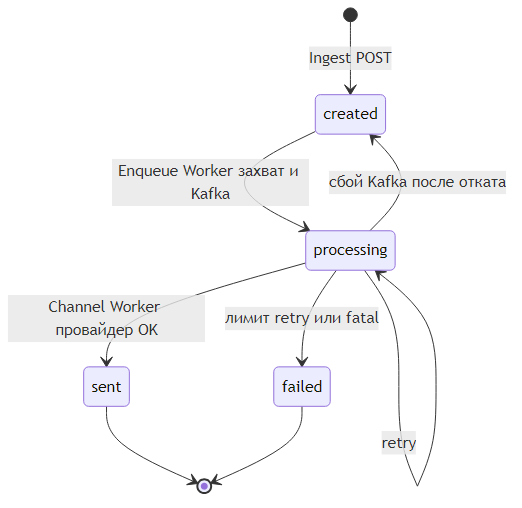
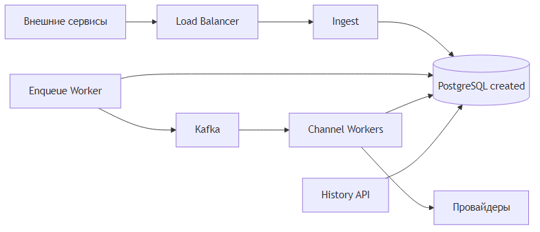
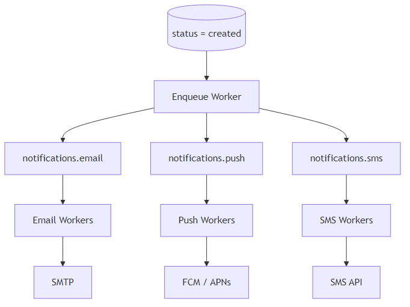
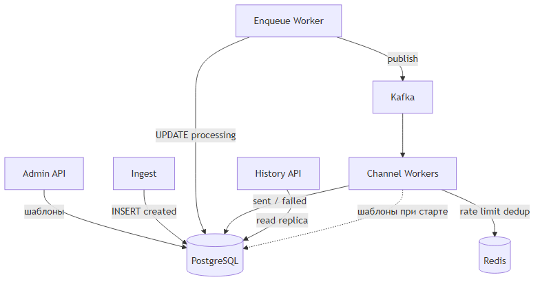
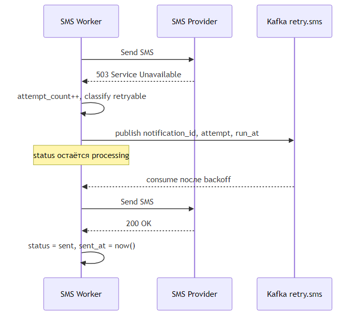
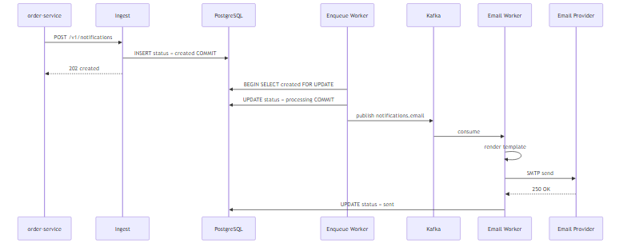
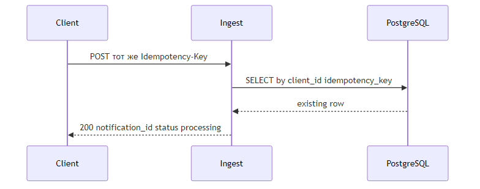
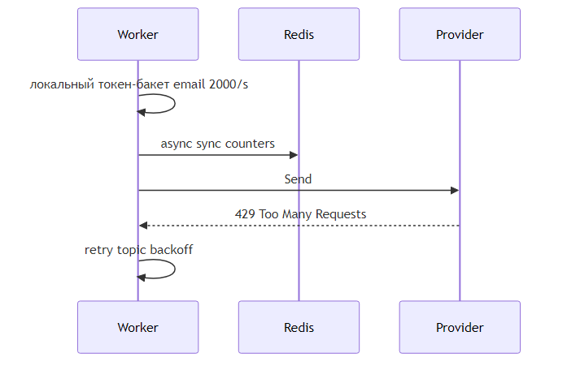
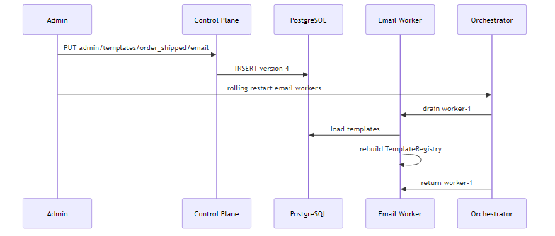

# Техническое решение проекта «Сервис уведомлений»

## 1. Введение

Сервис уведомлений — входная точка для внутренних систем, которым нужно доставить пользователю сообщение по одному из каналов: email, push или SMS. Внешний сервис не общается с провайдерами напрямую: он передаёт тип уведомления, получателя, канал и параметры для шаблона, а платформа берёт на себя маршрутизацию, подготовку текста, отправку и учёт результата.

Пиковая нагрузка — до **20 000 запросов на создание уведомления в секунду**. На критическом пути остаётся только приём и надёжная фиксация факта постановки в очередь (P95 ≤ 100 мс). Фактическая доставка выполняется асинхронно и зависит от канала и внешнего провайдера.

Ключевые ограничения, которые определяют архитектуру:

- высокая доля записи при приёме;
- внешние провайдеры с лимитами и периодической недоступностью;
- запрет на «случайные» дубли при повторных запросах клиента и при at-least-once доставке внутри платформы.

Решение разделено на **Control Plane** (шаблоны, политики каналов, настройки провайдеров) и **Data Plane** (приём, очередь, воркеры отправки, история).

---

## 2. Глоссарий

| Термин | Определение |
|--------|-------------|
| Уведомление | Сущность с идентификатором, получателем, каналом, типом и жизненным циклом доставки. |
| Канал доставки | Способ отправки: `email`, `push`, `sms`. У каждого канала свои лимиты на размер и формат сообщения. |
| Шаблон | Текстовая заготовка с плейсхолдерами; компилируется при старте воркера. |
| Провайдер | Внешний API доставки (SMTP-шлюз, FCM/APNs, SMS-агрегатор). |
| Idempotency key | Ключ, который клиент передаёт для защиты от повторного создания при ретрае HTTP. |
| Enqueue Worker | Сервис, который забирает уведомления со статусом `created`, переводит в `processing` и публикует в Kafka. |
| Retry | Повторная попытка отправки после временной ошибки провайдера. |
| Rate limiting | Ограничение скорости вызовов провайдера и/или приёма по клиенту. |
| Deduplication | Гарантия, что одно логическое уведомление не уйдёт пользователю дважды. |

---

## 3. Функциональные требования

Система обеспечивает:

1. **Приём запросов:** создание уведомления с указанием получателя (`recipient_id` или адрес), канала, типа и параметров шаблона; возврат `notification_id` и текущего статуса.
2. **Каналы:** независимая обработка email, push и SMS с валидацией формата до вызова провайдера.
3. **Шаблоны:** выбор шаблона по типу и каналу, подстановка параметров, формирование итогового тела/заголовка перед отправкой.
4. **Отправка:** вызов провайдера, сохранение результата (`provider_message_id`, код ошибки, время).
5. **Retry:** повтор при временных сбоях, ограничение числа попыток, перевод в `failed` после исчерпания лимита.
6. **Дедупликация:** защита от дублей при повторе HTTP-запроса, повторной обработке сообщения из брокера и сбоях между записью в БД и вызовом провайдера.
7. **Статусы:** `created` → `processing` → `sent` | `failed`.
8. **История:** выборка по получателю/периоду с каналом, временем отправки и статусом.

---

## 4. Нефункциональные требования

| Область | Требование | Следствие для архитектуры |
|---------|------------|---------------------------|
| Нагрузка | до 20 000 RPS на приём в пике | Горизонтально масштабируемый stateless Ingest, партиционированная очередь |
| Latency приёма | P95 ≤ 100 мс | Нет синхронного вызова провайдера в HTTP-обработчике; минимум обращений к БД |
| Надёжность | не терять принятые уведомления | Запись `created` при приёме; Enqueue Worker с `FOR UPDATE SKIP LOCKED`; Kafka с репликацией; идемпотентные consumer |
| Консистентность | надёжный факт приёма; история — eventual | Запись в primary PostgreSQL; проекция истории может отставать на секунды |
| Масштабирование | отдельно: приём, маршрутизация, каналы, история | Разные consumer groups и пулы воркеров |
| Ограничения | rate limit, изоляция каналов | Отдельные топики/воркеры и circuit breaker на провайдер |

---

## 5. Пользовательские сценарии

### Сценарий 1: Успешная отправка

1. Сервис заказов вызывает `POST /v1/notifications` с типом `order_shipped`, каналом `email`, `recipient_id` и параметрами `{ "order_id": "A-42" }`.
2. Ingest проверяет запрос и сохраняет уведомление со статусом `created`.
3. Клиент получает `202 Accepted` и `notification_id`.
4. Enqueue Worker переводит запись в `processing` и публикует событие в Kafka.
5. Email-воркер подставляет шаблон, отправляет письмо через SMTP-шлюз, переводит статус в `sent`.
6. При запросе истории пользователь видит запись с каналом, временем и статусом `sent`.

### Сценарий 2: Повтор HTTP-запроса клиентом

1. Клиент повторяет тот же запрос с тем же заголовком `Idempotency-Key` из-за таймаута сети.
2. Ingest находит существующую запись и возвращает тот же `notification_id` и статус без повторной постановки в очередь.

### Сценарий 3: Временная недоступность SMS-провайдера

1. SMS-воркер получает 503 от провайдера.
2. Уведомление остаётся в `processing`, попытка планируется в топик отложенных retry с backoff.
3. Email и push продолжают работать — отдельные очереди и лимиты.
4. После исчерпания лимита попыток статус становится `failed`, в истории фиксируется причина.

### Сценарий 4: Обновление шаблона

1. Администратор через Control Plane сохраняет новую версию шаблона `order_shipped` для канала `email`.
2. Запускается rolling restart email-воркеров: узел снимается с обработки, поднимается с загрузкой шаблонов из PostgreSQL.
3. Уже принятые уведомления обрабатываются по версии шаблона, зафиксированной в момент постановки (см. §6).

---

## 6. Модель уведомления и жизненный цикл

### 6.1. Логическая модель

**Notification** (основная сущность):

| Поле | Тип | Описание |
|------|-----|----------|
| `notification_id` | UUID | Первичный ключ, генерируется сервисом |
| `idempotency_key` | string | Ключ клиента, уникален в паре с `client_id` |
| `client_id` | string | Идентификатор вызывающей системы |
| `recipient_id` | string, optional | Внутренний ID пользователя |
| `recipient_address` | string, optional | Email / phone / device token |
| `channel` | enum | `email` \| `push` \| `sms` |
| `notification_type` | string | Код типа для выбора шаблона |
| `template_version` | int | Версия шаблона на момент приёма |
| `payload` | JSONB | Параметры для подстановки |
| `status` | enum | `created`, `processing`, `sent`, `failed` |
| `created_at` | timestamptz | Время приёма |
| `sent_at` | timestamptz, optional | Время успешной доставки |
| `failed_at` | timestamptz, optional | Время финального отказа |
| `attempt_count` | int | Число попыток отправки |
| `last_error` | string, optional | Код/текст последней ошибки |
| `provider_message_id` | string, optional | ID у провайдера |
| `processing_at` | timestamptz, optional | Момент перевода в `processing` (Enqueue Worker) |

Индекс для постановки в очередь: `(status, created_at) WHERE status = 'created'`.

**Смысл статусов в этой архитектуре**

| Статус | Значение |
|--------|----------|
| `created` | Принято Ingest, **ещё не** опубликовано в Kafka |
| `processing` | Захвачено Enqueue Worker, событие в Kafka (или ожидает доставки Channel Worker) |
| `sent` / `failed` | Финальный результат вызова провайдера |

**DeliveryAttempt** (аудит попыток, защита от двойной отправки на уровне воркера):

| Поле | Описание |
|------|----------|
| `notification_id` | Ссылка на уведомление |
| `attempt_no` | Номер попытки (1..N) |
| `started_at` / `finished_at` | Интервал попытки |
| `result` | `success` \| `retryable_error` \| `fatal_error` |

**Template** (Control Plane):

| Поле | Описание |
|------|----------|
| `notification_type` + `channel` | Составной ключ |
| `version` | Монотонно растущая версия |
| `subject_template` | Для email (optional) |
| `body_template` | Текст с `{{.var}}` |
| `max_body_bytes` | Лимит канала |

### 6.2. Диаграмма состояний



Переход в `failed` без возврата: после финального отказа уведомление не отправляется повторно автоматически. Повторная доставка — только новый запрос клиента с новым `notification_id` (и осознанным бизнес-решением).

### 6.3. Пример API приёма

```http
POST /v1/notifications HTTP/1.1
Host: notify.internal
Content-Type: application/json
Idempotency-Key: 7f3c2a1b-orders-8821
X-Client-Id: order-service

{
  "channel": "email",
  "notification_type": "order_shipped",
  "recipient_id": "user-9912",
  "recipient_address": "user@example.com",
  "payload": {
    "order_id": "A-42",
    "tracking_url": "https://shop.example/track/A-42"
  }
}
```

Ответ при первом приёме:

```json
{
  "notification_id": "550e8400-e29b-41d4-a716-446655440000",
  "status": "created",
  "created_at": "2026-05-18T14:22:01Z"
}
```

### 6.4. Структуры в памяти (Data Plane)

На воркерах канала при старте из PostgreSQL загружается неизменяемый снимок шаблонов и лимитов:

| Структура | Назначение |
|-----------|------------|
| `TemplateRegistry` | `map[channel]map[type]*CompiledTemplate` |
| `CompiledTemplate` | Распарсенный `text/template`, лимиты размера, версия |
| `ChannelLimits` | `MaxBodyBytes`, `RatePerSecond`, `MaxRetries`, `BackoffMs[]` |
| `ProviderClient` | HTTP/SMTP-клиент с таймаутами и connection pool |

Рендер выполняется в памяти без запроса к БД на горячем пути отправки.

---

## 7. Архитектура системы

Архитектура разбита на три схемы: общий поток данных, маршрутизация по каналам и связь компонентов с хранилищами.

**Общий поток:** клиент → Ingest (`created`) → Enqueue Worker (`processing` + Kafka) → Channel Workers → провайдер. Отдельной таблицы outbox нет: роль очереди на приёме выполняют статус и Enqueue Worker.



**Маршрутизация по каналам:** Enqueue Worker публикует сразу в топик `notifications.email`, `notifications.push` или `notifications.sms` по полю `channel`.



**Хранилища и Control Plane:** PostgreSQL — источник истины; Redis — rate limit и dedup; Admin API управляет шаблонами без участия в горячем пути.



### 7.1. Компоненты

**Ingest (stateless, Go)**  
HTTP-сервер: валидация JSON, проверка idempotency, один `INSERT` в `notifications` со статусом `created`. Ответ клиенту — сразу после `COMMIT`. **Kafka на этом этапе не вызывается** — так сохраняется P95 ≤ 100 мс.

**Enqueue Worker (stateless, Go, горизонтально масштабируется)**  
Цикл постановки в брокер без таблицы outbox:

```sql
BEGIN;
SELECT notification_id, channel, ... 
FROM notifications
WHERE status = 'created'
ORDER BY created_at
LIMIT 1
FOR UPDATE SKIP LOCKED;

UPDATE notifications
SET status = 'processing', processing_at = now()
WHERE notification_id = :id AND status = 'created';
COMMIT;
```

После успешного `COMMIT` — `publish` в Kafka (топик по `channel`). Ключ сообщения: `notification_id`.

> **Важно:** Kafka не участвует в транзакции PostgreSQL. Сначала фиксируем `processing` в БД, затем публикуем в брокер. Если publish не удался — `UPDATE status = 'created'` для отката (см. §7.2). Отдельная outbox-таблица не нужна: роль «задачи на публикацию» выполняет множество строк со статусом `created`.

**Kafka**  
Топики:

- `notifications.email` / `notifications.push` / `notifications.sms` — публикация из Enqueue Worker;
- `notifications.retry.{channel}` — отложенные повторы Channel Worker;
- `notifications.dlq.{channel}` — ручной разбор после исчерпания retry.

**Channel Workers**  
Consumer group на канал. Статус уже `processing`. Пайплайн: render template → rate limit → dedup lock → provider → `sent` / retry / `failed`. Повторное сообщение из Kafka при `sent` — только commit offset.

**History API**  
`GET /v1/notifications` с фильтрами `recipient_id`, `channel`, `from`, `to`, `status`. Чтение с read-replica PostgreSQL; допустимое отставание реплики — до 1–2 с.

**Control Plane**  
REST для CRUD шаблонов и лимитов провайдеров. Изменения применяются через rolling restart воркеров соответствующего канала (как в проекте API Gateway).

**Redis**  
- ключи idempotency на горячем пути (кэш «уже видели» на 24 ч);  
- счётчики rate limit (локальный буфер на воркере + асинхронная синхронизация с Redis);  
- distributed lock `send:{notification_id}` на время вызова провайдера (TTL 30–60 с).

**PostgreSQL**  
Источник истины: уведомления, попытки, шаблоны. Кластер Patroni (3 узла). Очередь на постановку в Kafka — строки со статусом `created`.

### 7.2. Постановка в Kafka без outbox (отказоустойчивость)

| Ситуация | Поведение |
|----------|-----------|
| `COMMIT` прошёл, Kafka недоступна | Строка в `processing`, сообщения в брокере нет. Reconciler через T сек возвращает в `created`, если нет consumer lag по `notification_id`, либо повторный publish из `processing` |
| Kafka ack, consumer уже обработал | Идемпотентность по `notification_id` в Channel Worker |
| Enqueue Worker упал после `COMMIT`, до publish | Запись в `processing` без сообщения в Kafka — reconciler публикует повторно или откатывает в `created` |
| Несколько Enqueue Worker | `FOR UPDATE SKIP LOCKED` — одна строка обрабатывается одним инстансом |

Метрика вместо outbox lag: **`notify_created_queue_lag_seconds`** = `now() - min(created_at) WHERE status = 'created'`.


---

## 8. Подход к шаблонам

1. Шаблоны хранятся в PostgreSQL, версионируются (`notification_type`, `channel`, `version`).
2. При приёме Ingest записывает в уведомление `template_version` — актуальную на момент запроса. Так изменение шаблона не ломает уже принятые сообщения.
3. Воркер при старте загружает все активные версии в `TemplateRegistry` (in-memory).
4. Рендер: `text/template` для тела, отдельно subject для email. После рендера — проверка `len(body) <= max_body_bytes` канала; превышение → `failed` с кодом `MESSAGE_TOO_LARGE` без вызова провайдера.
5. Push: шаблон формирует title + body JSON для FCM; SMS — только body с лимитом 160/70 символов (GSM-7 / UCS-2) по политике оператора.

Пример шаблона в БД:

```yaml
notification_type: order_shipped
channel: email
version: 3
subject_template: "Заказ {{.order_id}} отправлен"
body_template: |
  Здравствуйте!
  Ваш заказ {{.order_id}} передан в доставку.
  Отслеживание: {{.tracking_url}}
max_body_bytes: 65536
```

---

## 9. Retry и ошибки провайдеров

### 9.1. Классификация ошибок

| Класс | Примеры | Действие |
|-------|---------|----------|
| Retryable | HTTP 429, 502, 503, timeout, connection reset | Повтор с backoff |
| Fatal | 400, 401, 404, невалидный адрес, policy violation | `failed` без retry |
| Unknown | Прочие 5xx после N попыток | `failed` |

### 9.2. Политика по умолчанию (настраивается в Control Plane)

- `max_attempts`: 5  
- `backoff_ms`: [1000, 5000, 15000, 60000, 300000]  
- сообщение в `notifications.retry.{channel}` с заголовком `scheduled_at`

Воркер не блокирует поток ожиданием: при retryable ошибке обновляет `attempt_count`, публикует в retry-топик и коммитит offset. Отдельный consumer (или тот же с фильтром по времени) подхватывает задачу позже.

### 9.3. Circuit breaker на провайдер

При доле ошибок > 50% за скользящее окно 30 с воркер канала переходит в **open**: новые задачи из топика не вызывают провайдер, а сразу уходят в retry-топик. Через 20 с — **half-open** (пробные запросы). Это изолирует «шторм» ошибок SMS от стабильного email.



---

## 10. Предотвращение дублей

Три уровня, как требует задание:

**1. Повтор HTTP-запроса клиента**  
Уникальный индекс `(client_id, idempotency_key)` в PostgreSQL. Ingest при конфликте возвращает `200` с телом существующего уведомления. Дополнительно Redis `SET idemp:{client_id}:{key} 1 NX EX 86400` снижает нагрузку на БД при шторме ретраев.

**2. Повтор сообщения из Kafka**  
Ключ сообщения = `notification_id`. Перед вызовом провайдера воркер проверяет: если статус уже `sent` — commit offset без отправки. Таблица `delivery_attempts` с уникальным `(notification_id, attempt_no)` не даёт задублировать одну и ту же попытку.

**3. Сбой между БД и провайдером**  
Сценарий: провайдер принял сообщение, воркер упал до UPDATE статуса. При повторе consumer видит `provider_message_id` в попытке или делает **status check** у провайдера (если API поддерживает) перед повторной отправкой. Для SMTP/SMS без status API — Redis-lock `send:{notification_id}` и запись `provider_message_id` сразу после ответа провайдера в той же транзакции, что и `sent` (где возможно — двухфазно: сначала external id, потом status).

Итог: at-least-once в брокере превращается в **effectively-once** для пользователя.

---

## 11. История уведомлений

- Основная таблица `notifications` — источник для API истории.
- Индексы: `(recipient_id, created_at DESC)`, `(recipient_id, channel, created_at DESC)`.
- Read API обслуживает read-replica; eventual consistency для истории допустима по ТЗ.
- Для тяжёлых выборок (админ-отчёты) можно добавить асинхронную проекцию в отдельную таблицу `notification_history` через CDC (Debezium) — в базовом решении не требуется, оставлено как путь роста.

```http
GET /v1/notifications?recipient_id=user-9912&from=2026-05-01&to=2026-05-18&limit=50
```

```json
{
  "items": [
    {
      "notification_id": "550e8400-e29b-41d4-a716-446655440000",
      "channel": "email",
      "notification_type": "order_shipped",
      "status": "sent",
      "created_at": "2026-05-18T14:22:01Z",
      "sent_at": "2026-05-18T14:22:04Z"
    }
  ],
  "next_cursor": "..."
}
```

---

## 12. Технические сценарии

### 12.1. Успешная отправка (сквозной путь)



### 12.2. Идемпотентный повтор запроса



### 12.3. Rate limit провайдера



Локальный буфер на воркере даёт быстрый отказ без похода в Redis на каждое сообщение; периодическая синхронизация — как в решении API Gateway.

### 12.4. Обновление шаблонов



### 12.5. Постановка в очередь (created → processing → Kafka)


---

## 13. Масштабирование и отказоустойчивость

### 13.1. Оценка ёмкости

- Ingest на Go: порядка **6–8k RPS на ядро** (только INSERT `created`).  
- Для **20k RPS** приёма — **4–6 инстансов** Ingest.  
- Enqueue Worker: **4–8 инстансов**, тот же порядок RPS на захват + publish.  
- Kafka: **32–48 партиций** на каждый канальный топик (ключ `notification_id`).  
- Channel Workers масштабируются **независимо** по каналам.

### 13.2. Отказоустойчивость

| Событие | Поведение |
|---------|-----------|
| Падение инстанса Ingest | LB убирает узел; клиент ретраит; idempotency защищает от дублей |
| Недоступность Kafka | Ingest продолжает писать `created`; Enqueue Worker копит lag, после восстановления догоняет |
| Зависшие в `processing` | Reconciler откатывает в `created` или повторяет publish |
| Падение SMS-воркеров | Email/push не затрагиваются |
| Недоступность Redis | Rate limit по локальному буферу; dedup опирается на PostgreSQL |
| Недоступность Control Plane | Приём и отправка работают; меняются только шаблоны |

### 13.3. Технологический стек

| Слой | Технологии |
|------|------------|
| Ingest, Enqueue Worker, Channel Workers, History | Go, `chi`, `pgx`, `segmentio/kafka-go` |
| Шаблоны | `text/template` |
| Брокер | Kafka (3+ брокера, replication factor 3) |
| БД | PostgreSQL 16, Patroni |
| Кэш / лимиты | Redis Cluster |
| Метрики | Prometheus |
| Логи | `slog` → Vector → OpenSearch |
| Балансировка | HAProxy / cloud LB |

### 13.4. Наблюдаемость

Метрики Prometheus:

- `notify_accept_total{client, channel, status}`  
- `notify_accept_duration_seconds` (гистограмма, SLA P95)  
- `notify_delivery_total{channel, result}`  
- `notify_retry_total{channel}`  
- `notify_provider_errors_total{channel, code}`  
- `notify_rate_limit_hits_total{channel}`  
- `notify_created_queue_lag_seconds`  
- `notify_processing_stuck_total`  

Алерты: рост `created_queue_lag`, доля `failed` > порога по каналу, consumer lag > 30 с.

---

## 14. Обоснование архитектуры

**Почему асинхронная доставка.** Требование P95 ≤ 100 мс на приёме несовместимо с синхронным ожиданием SMTP/FCM/SMS-шлюза. Разделение «принять» и «доставить» — стандартный паттерн notification-платформ.

**Почему Kafka после статуса `processing`.** Ingest только пишет `created` — быстрый приём. Enqueue Worker отдельно масштабируется и переводит задачи в брокер. Статус `created` — очередь на публикацию без отдельной outbox-таблицы. Kafka даёт буфер и изоляцию каналов на этапе доставки.

**Почему не outbox.** Достаточно поля `status`: строки `created` — work queue для Enqueue Worker; `FOR UPDATE SKIP LOCKED` даёт конкурентную обработку. Меньше сущностей в модели данных при явном компромиссе: reconciler для пары `processing` + сбой Kafka (см. §7.2).

**Почему отдельные воркеры на канал.** Разные лимиты провайдеров, разная стоимость ошибки и требование изоляции из §4.6. Один «универсальный» воркер при падении SMS-адаптера замедлил бы обработку email.

**Почему версия шаблона в уведомлении.** Без привязки к версии rolling update шаблона менял бы текст уже принятых, но ещё не отправленных сообщений — это непредсказуемо для бизнеса.

---

## 15. Компромиссы

| Решение | Плюс | Минус |
|---------|------|-------|
| Статус `created` вместо outbox | Проще модель данных, одна таблица | Reconciler для `processing` при сбое Kafka; конкуренция за индекс `(status, created_at)` |
| Разделение Ingest и Enqueue | Быстрый HTTP-приём | Дополнительный сервис и lag `created` → `processing` |
| Шаблоны in-memory на воркере | Быстрый рендер | Rolling restart при изменениях |
| Локальный rate limit + Redis | Низкая задержка, защита провайдера | Кратковременная рассинхронизация лимитов между узлами |
| Effectively-once через БД + lock | Нет дублей для пользователя | Дополнительные записи и проверки |
| История с read-replica | Разгрузка primary | Возможное отставание 1–2 с |
| Нет синхронного API «доставлено» | Простой контракт приёма | Клиент опрашивает историю или подписывается на события (webhook — вне scope) |

---

## 16. Ограничения и развитие

В рамках задания **не проектируются**: аутентификация клиентов (предполагается mTLS на периметре), UI админки, мультитенантность с квотами на организацию, A/B текстов шаблонов.

Логичные следующие шаги: webhook `notification.status_changed` для подписчиков, отдельный cold storage для архива истории старше 90 дней, приоритетные очереди для OTP-SMS.
